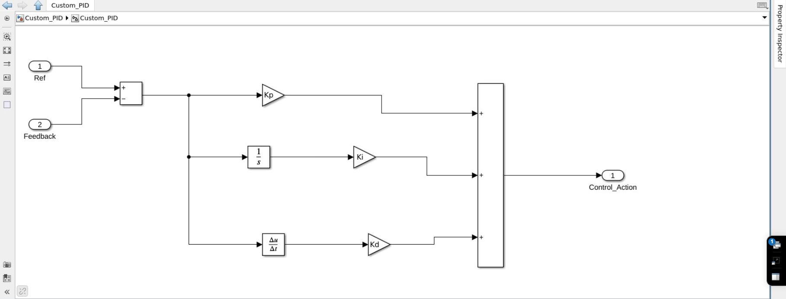

# Project: DC Electric Motor Model with Custom PID Controller in Matlab/Simulink

## Project Description:
This project involves creating a mathematical model of a DC (direct current) electric motor in Matlab/Simulink and implementing a custom PID controller to regulate the motor's rotational speed. Electric motors are essential components in various applications, from industrial machinery to electric vehicles. Controlling the motor's speed is crucial for efficient system operation, and the PID controller is a commonly used tool to achieve this goal.

## Project Objectives:
- Develop a mathematical model of a DC electric motor in Matlab/Simulink.
- Implement a PID controller to regulate the motor's rotational speed.
- Optimize PID controller parameters to achieve stable and efficient regulation.
- Analyze the system's performance under different operating conditions and motor loads.

## DC Motor 

## Custom PID 

## Controler

## Result

